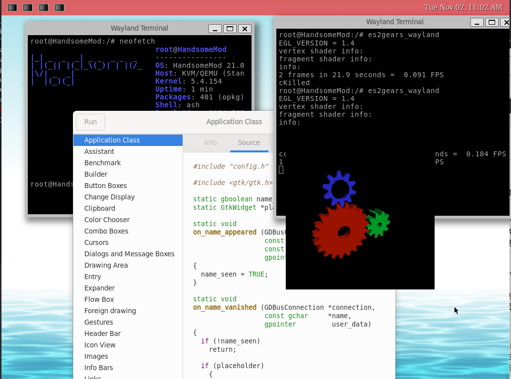
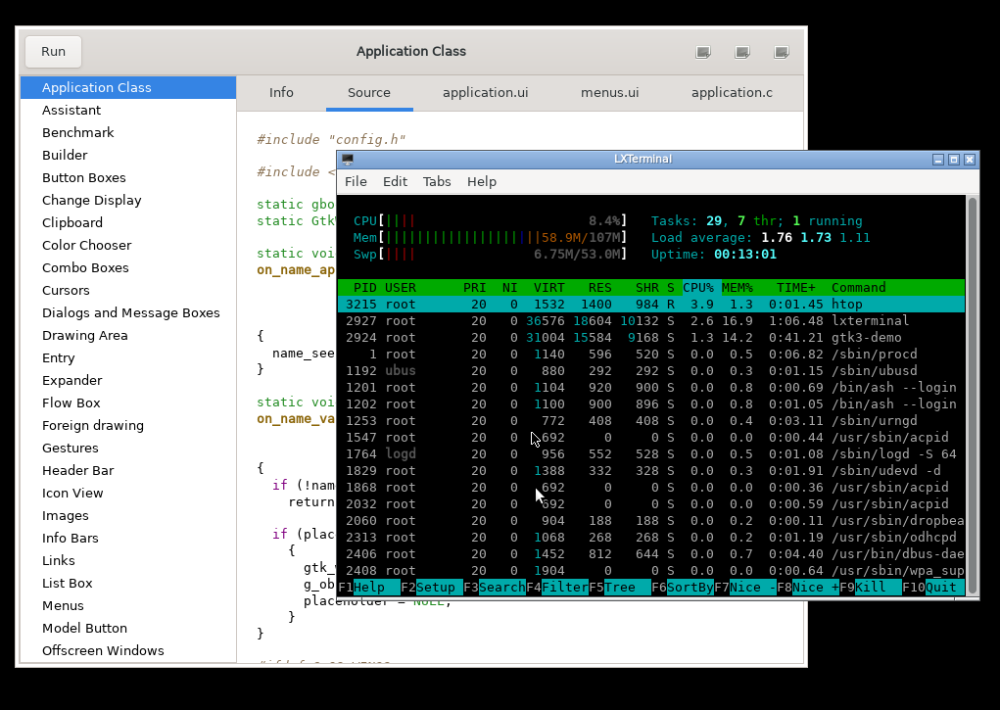

<h1 align="center">HandsomeMod 21.03</h1>
<h4 align="center">IOT Freedom For End-user!</h4>

## Feature Overview

- Opkg Packager Manager and Procd init.
- Lower memory usage than Debian or some systemd-based linux.
- Support Qt5 Gtk3 Xorg Wayland and lots of Graphics Stuff.
- Support sound csi camera encoder&decoder drm on Allwinner platform.
- Support librarys commonly use in embedded project.(opencv ncnn wiringpi etc)
- Support Networkmanager and Connman. 
- Just-enough Generic OS for embedded devices!

## Building Firmware

To build your own firmware you need a Linux, BSD or MacOSX system (case
sensitive filesystem required). Cygwin is unsupported.

You need gcc, binutils, bzip2, flex, python, perl, make, find, grep, diff,
unzip, gawk, getopt, subversion, libz-dev and libc headers installed.

1. Run "./scripts/feeds update -a" to obtain all the latest package definitions
defined in feeds.conf / feeds.conf.default

2. Run "./scripts/feeds install -a" to install symlinks for all obtained
packages into package/feeds/ 

3. Run "make menuconfig" to select your preferred configuration for the
toolchain, target system & firmware packages.

4. Run "make" to build your firmware. This will download all sources, build
the cross-compile toolchain and then cross-compile the Linux kernel & all
chosen applications for your target system.

## Mainly Supporting Platform

This means those socs can get better support than others.

- Allwinner Socs (linux mainline)
- Qualcomm MSM89xx Family
- Rapsberry pi
- X86
- Freescale I.MX6ULL Family (WIP)
- Loongson64 Family (WIP)
- Allwinner Socs (bsp kernel) (Planing)

## Thanks

HandsomeMod based on OpenWrt project.

	* branch : openwrt-21.02
	* commit: 39bf2aee0ed840ff6bb4838bc0a42aaddc36a4d3

https://github.com/openwrt/openwrt

## Warning

* Now this project is not good enough for production environment.
* Some packages may buggy and unusable.

## License

HandsomeMod is licensed under GPL-2.0

